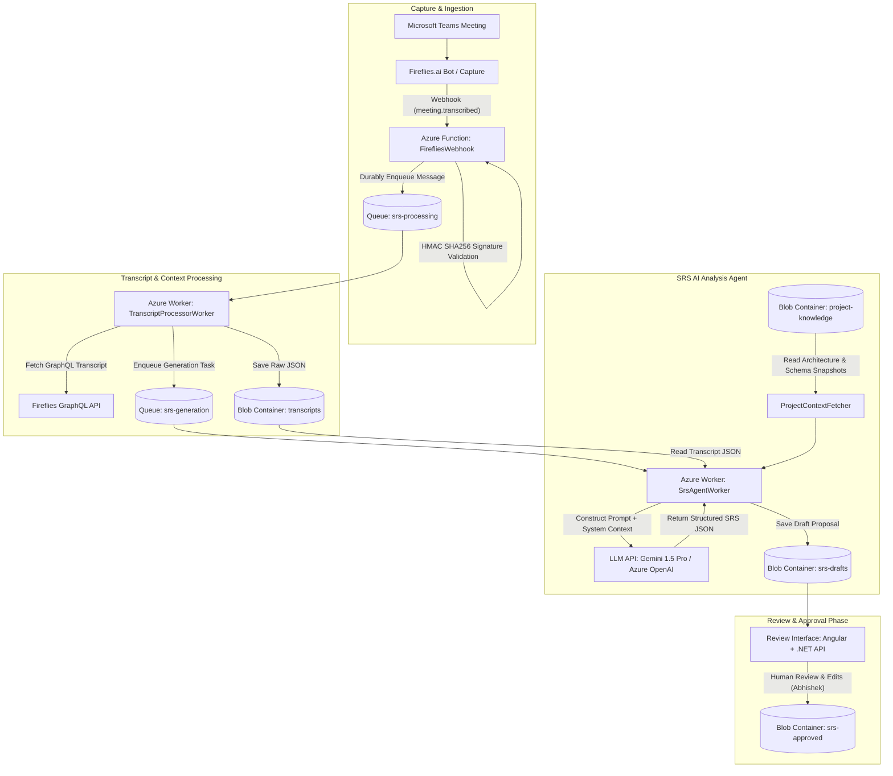

# SRG / Studio ID - SRS AI Automation Architecture

## 1. System Overview & Objective

The **SRS AI Pilot** (`SrsAi.Functions`) automates the extraction and structuring of Software Requirements Specifications (SRS) from team meetings captured via Microsoft Teams and Fireflies.ai. 

### Core Purpose
Transform raw meeting transcripts into structured, context-aware, and actionable SRS change proposals. The system compares client requests against the existing system architecture and database schema, highlighting impacts, potential conflicts, open questions, and required changes.

### Phase 1 Boundary
Phase 1 delivers a **versioned, human-reviewed SRS specification**. It explicitly **does not** perform automated code generation, automated database migrations, or direct production deployment. All AI proposals require explicit review and approval by human leads (e.g., Abhishek) via a dedicated review interface before any technical implementation begins.

---

## 2. End-to-End System Architecture

---

## 3. Data Flow & Execution Pipeline

1. **Meeting Webhook Receipt (`FirefliesWebhook.cs`)**:
   - Accepts `POST /api/integrations/fireflies/webhook`.
   - Validates the request using `X-Hub-Signature` (HMAC-SHA256 with `FirefliesWebhookSecret`).
   - Extracts `meeting_id`, `event`, and `timestamp`.
   - Enqueues a message to `srs-processing` queue and returns HTTP 200 within seconds.

2. **Transcript Processing & Storage (`TranscriptProcessorWorker.cs`)**:
   - Triggered by `srs-processing` queue.
   - Calls Fireflies GraphQL API (`https://api.fireflies.ai/graphql`) requesting `metadata`, `speakers`, `sentences`, and `summary`.
   - Stores the full transcript JSON into Azure Blob Storage (`transcripts/meeting-{meetingId}-{timestamp}.json`).
   - Enqueues a task payload to `srs-generation` queue.

3. **Context Fetching & Knowledge Layer (`ProjectContextFetcher.cs`)**:
   - Retrieves pre-compiled snapshots (`architecture.md` and `db-schema.json`/`db-schema.txt`) for the target project (e.g., `RSCS`) from `project-knowledge/{projectName}/` container in Azure Blob Storage.
   - Avoids expensive live database queries or Git clones during worker execution, ensuring low latency and strict isolation.

4. **SRS Analysis & Generation (`SrsAgentWorker.cs` & `SrsWordDocumentBuilder.cs`)**:
   - Triggered by `srs-generation` queue.
   - Reads transcript data and combines it with system architecture rules and federated database schema snapshots.
   - Sends a detailed context-aware prompt to Google Gemini 1.5 Pro (or Azure OpenAI).
   - Parses LLM output and validates required fields (`project`, `requirements`, `openQuestions`, `assumptions`).
   - Converts the structured requirements into a professionally styled, readable Microsoft Word document (`.docx`) using OpenXML SDK.
   - Saves the generated SRS draft Word document to `srs-drafts/srs-draft-{meetingId}-{timestamp}.docx` (along with the JSON metadata version `srs-draft-{meetingId}-{timestamp}.json`).

5. **Human Review & Approval (Target Review UI)**:
   - Displays side-by-side SRS changes, timestamped transcript snippets, and affected code/schema components.
   - Enables reviewers (e.g., Abhishek) to open, edit, and review the draft directly as an editable Word document or via the Angular web portal.
   - Approved specifications are persisted to `srs-approved/`.

---

## 4. Component Details & Codebase Structure

| Component File | Type | Primary Responsibility | Key Dependencies |
| :--- | :--- | :--- | :--- |
| [`Program.cs`](file:///c:/Projects/SrsAiPilot/SrsAi.Functions/Program.cs) | Application Entry Point | Configures Functions Web Application host & OpenTelemetry Application Insights exporter. | .NET 10 Isolated Worker, Azure OpenTelemetry |
| [`FirefliesWebhook.cs`](file:///c:/Projects/SrsAiPilot/SrsAi.Functions/FirefliesWebhook.cs) | HTTP Trigger Function | Receives webhooks from Fireflies, validates HMAC signatures, enqueues to `srs-processing`. | Azure Storage Queues, HMACSHA256 |
| [`TranscriptProcessorWorker.cs`](file:///c:/Projects/SrsAiPilot/SrsAi.Functions/TranscriptProcessorWorker.cs) | Queue Trigger Worker | Fetches full transcript via GraphQL, saves to `transcripts` blob container, enqueues to `srs-generation`. | Fireflies GraphQL API, Azure Blob Storage |
| [`ProjectContextFetcher.cs`](file:///c:/Projects/SrsAiPilot/SrsAi.Functions/ProjectContextFetcher.cs) | Helper Service | Reads snapshot context files (`architecture.md`, `db-schema.json`) from `project-knowledge` blob container. | Azure Storage Blobs |
| [`SrsWordDocumentBuilder.cs`](file:///c:/Projects/SrsAiPilot/SrsAi.Functions/SrsWordDocumentBuilder.cs) | Word Document Builder | Builds styled, formatted Microsoft Word documents (`.docx`) from structured requirement payloads. | DocumentFormat.OpenXml |
| [`EmailNotificationService.cs`](file:///c:/Projects/SrsAiPilot/SrsAi.Functions/EmailNotificationService.cs) | Email Notification Service | Formats HTML review summary emails with `.docx` attachments and dispatches to reviewers via SMTP. | System.Net.Mail |
| [`SrsListFunction.cs`](file:///c:/Projects/SrsAiPilot/SrsAi.Functions/SrsListFunction.cs) | HTTP API Endpoint | `GET /api/srs/drafts` - Lists all draft SRS documents in `srs-drafts` with secure 24-hr Read SAS token download URLs. | Azure.Storage.Sas |
| [`SrsAgentWorker.cs`](file:///c:/Projects/SrsAiPilot/SrsAi.Functions/SrsAgentWorker.cs) | Queue Trigger Worker | Combines transcript + snapshot context, invokes LLM, builds Word `.docx`, stores results in `srs-drafts`, and triggers email notification. | Google Gemini API / Azure OpenAI, OpenXML, EmailNotificationService |

---

## 5. Storage Layout & Queue Infrastructure

### Azure Blob Storage Containers
- **`transcripts/`**: Contains raw JSON meeting transcripts (`meeting-{meetingId}-{timestamp}.json`).
- **`project-knowledge/`**: Contains pre-compiled project knowledge snapshots (`{projectName}/architecture.md`, `{projectName}/db-schema.json`).
- **`srs-drafts/`**: Contains AI-generated draft SRS proposals stored as readable Word documents (`srs-draft-{meetingId}-{timestamp}.docx`) and JSON (`srs-draft-{meetingId}-{timestamp}.json`).
- **`srs-approved/`**: Stores final, human-approved versioned SRS documents (`.docx` / `.json`).

### Azure Storage Queues
- **`srs-processing`**: Holds webhook event payloads for transcript fetching.
- **`srs-generation`**: Holds transcript metadata for AI SRS analysis.

---

## 6. Security, Governance & Security Boundaries

1. **Authentication & Authorization**:
   - Public webhook endpoints enforce HMAC-SHA256 payload verification via `X-Hub-Signature`.
   - API Keys (`AiModelApiKey`, `FirefliesApiKey`) and secrets (`FirefliesWebhookSecret`) are stored in `local.settings.json` during local dev and Azure Key Vault in production.

2. **Read-Only Context Rule**:
   - The SRS Analysis Worker **never** receives direct database write permissions or repository push credentials.
   - Context is ingested via static, pre-compiled snapshots in `project-knowledge` Blob storage.

3. **Federated Database Support**:
   - Accommodates enterprise multi-catalog setups (e.g., `RSCS_MainLive` and `RSCS_ClientLive`).
   - Database schema snapshots explicitly map cross-catalog table relations (e.g., `Equipment`, `Heritage`, `Project`, `CRM`).

---

## 7. Technology Stack & Operational Configuration

- **Framework**: .NET 10 (Isolated Worker Model), Azure Functions v4.
- **Hosting**: Azure Functions (Flex Consumption / Windows Consumption).
- **LLM Provider**: Google Gemini 1.5 Pro API (or Azure OpenAI Service).
- **Telemetry & Monitoring**: Application Insights / OpenTelemetry.
- **Client Timeout**: `HttpClient` configured with a 5-minute timeout for LLM inference calls.
